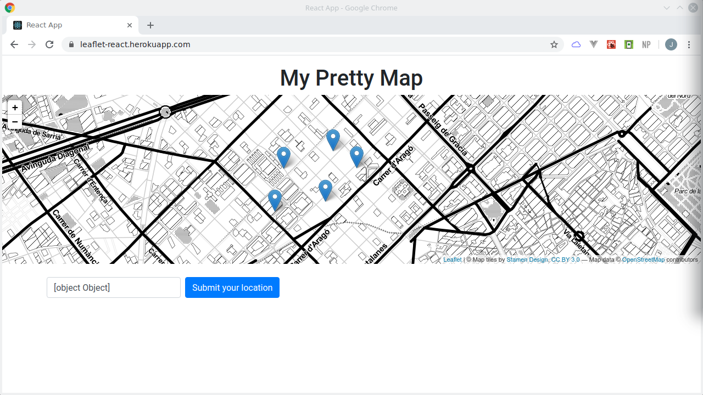

# React-Leaflet Demo

The purpose of this project is to show a minimal example, of how-to use Leaflet whithin React.

[Leaflet](https://leafletjs.com/) is an open-source JavaScript library for building interactive maps.

This project uses the [react-leaflet](https://www.npmjs.com/package/react-leaflet) library, which packages Leaflet into React components.

Please take some time to get familiar with the react-leaflet library, and with Leaflet itself, by reading the documentation.

On the github repository of the project, you will find a folder with [examples](https://github.com/PaulLeCam/react-leaflet/tree/c13eeadddd06902c34988493ec1d84616a27d486/example)

## INSTALL

Run this application with yarn:

``` bash
yarn
yarn start
```

Then open it on a browser, at: 

http://localhost:5000

## Deploy

*Please ignore this part, if you just want to run the application on local!*

This application was deployed at heroku

``` bash
git push heroku master
```

You can view the deployed application on:

- https://leaflet-react.herokuapp.com/



## Use

You can use this application to add points to the map. The application will read the latitude and longitude from a JSON object, and display a marker with the point on the map. 

For example, this is a string which represents the coordinates of NYC:

``` bash
{"lat": 40.730610, "lng": -73.935242}
```

To try it out, input this string into the input box. The map bounds will be adjusted to display this point, using a flying animation. You can try it with the coordinates of any other location (in WGS84) in the earth's surface.

You can also use this application to add markers to the map, just by clicking in the map's surface.